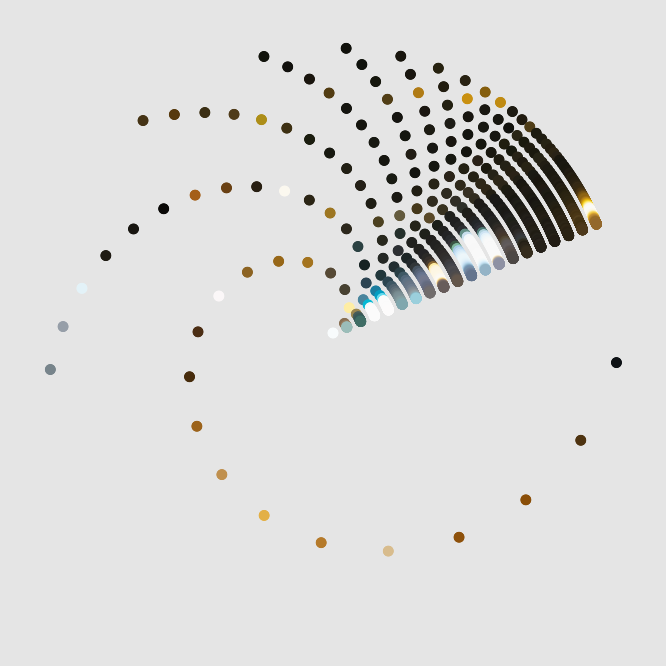
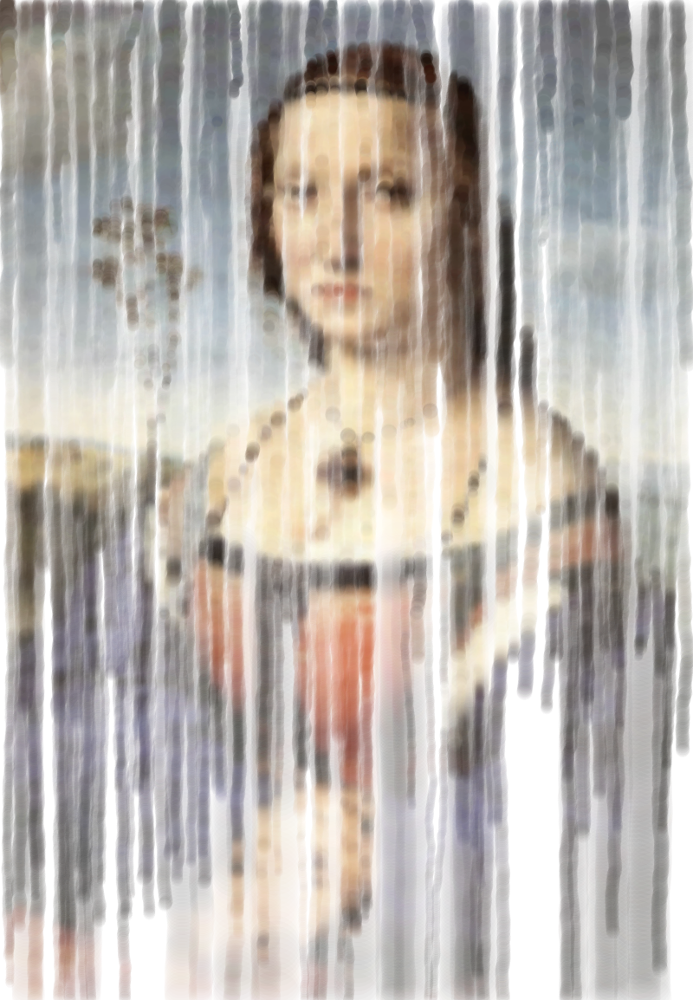
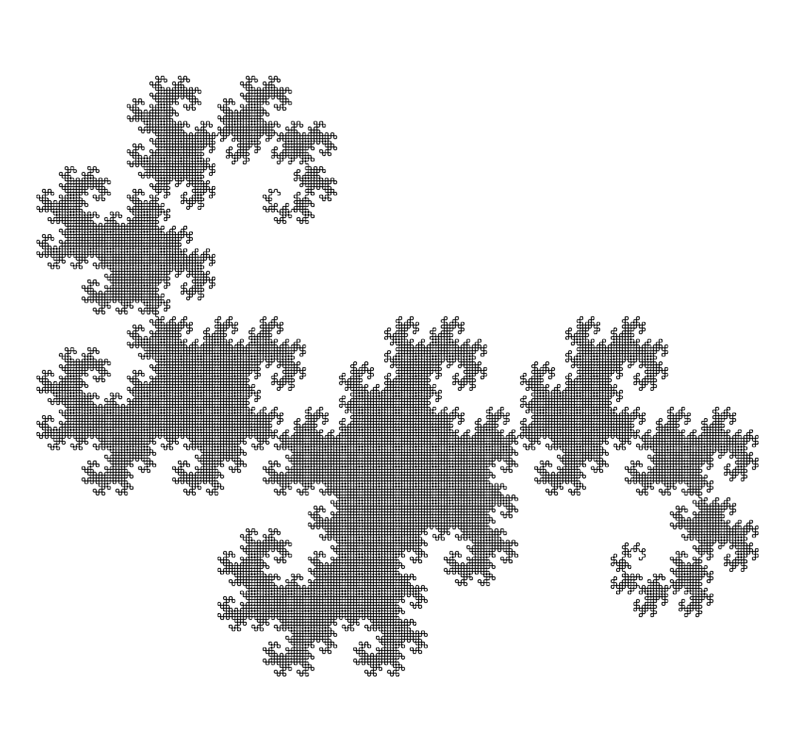
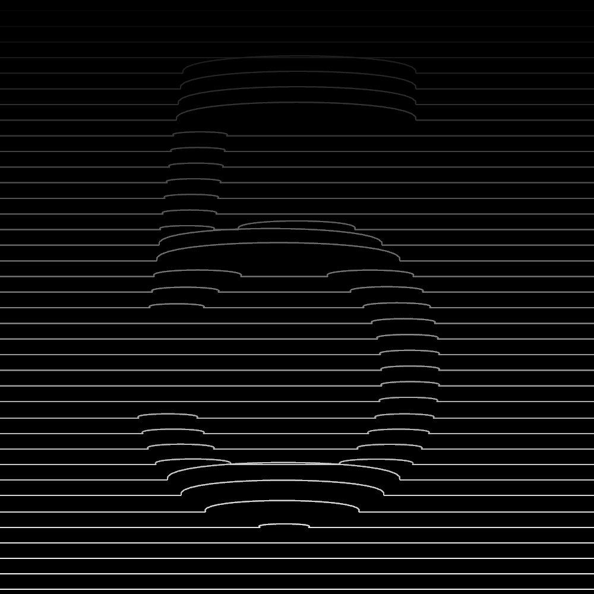
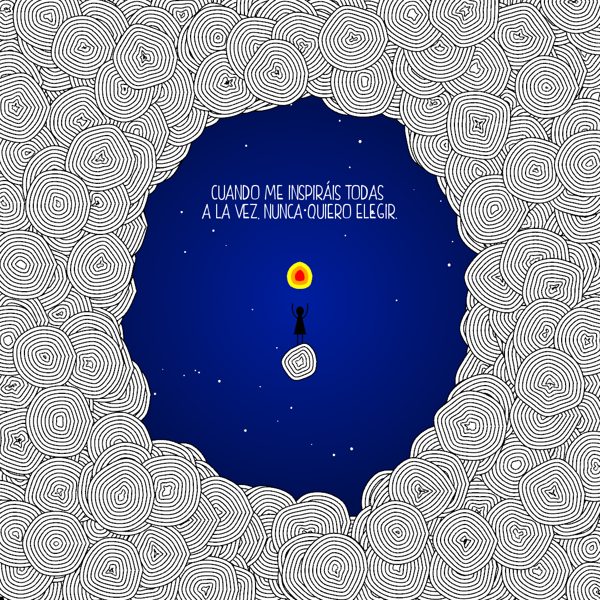
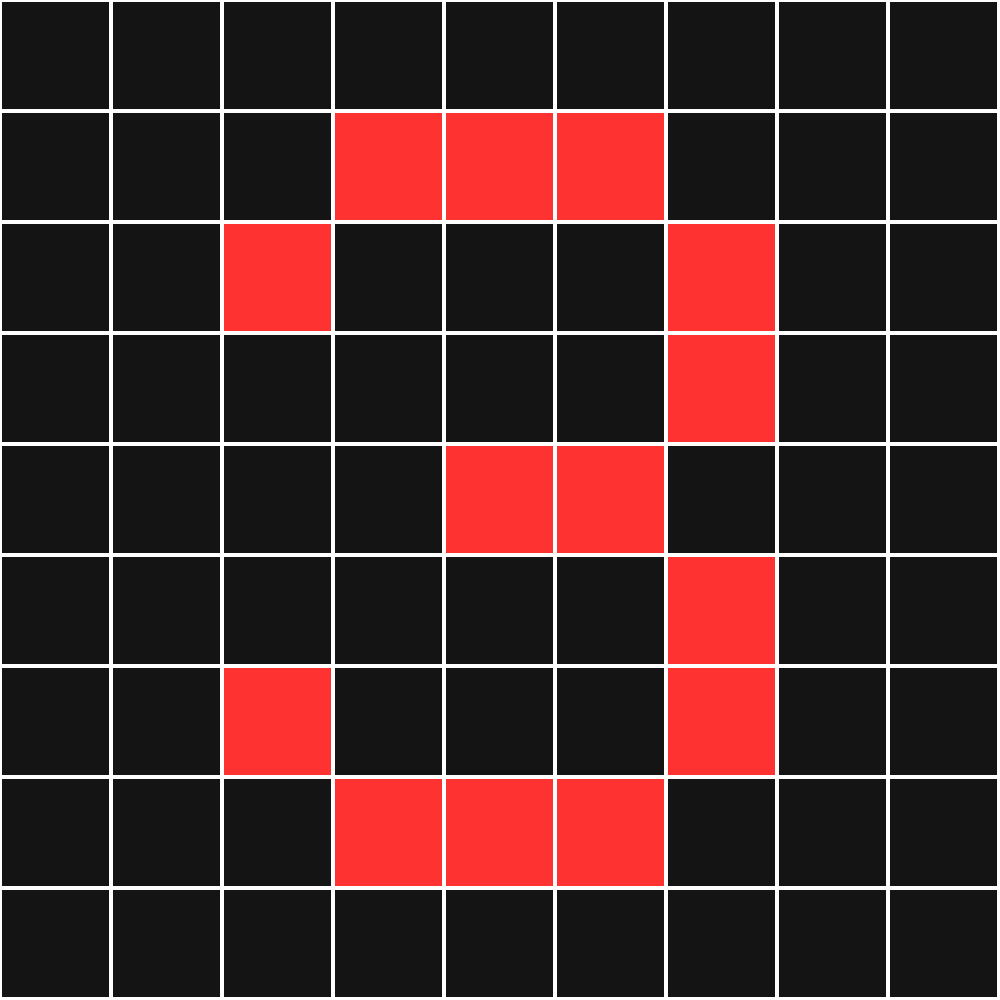
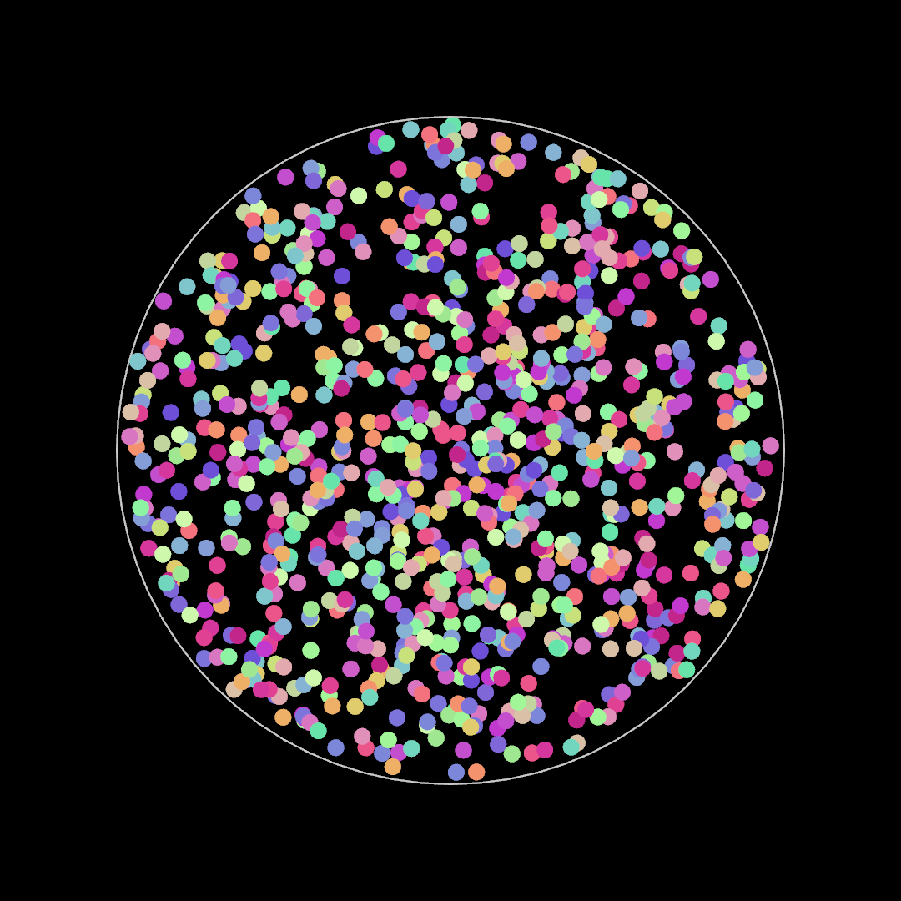

# ofxSoological

This is a personal project to learn how to code art with [openframeworks](https://openframeworks.cc/) in C++. The intention is to regularly post a new openframeworks app generating an animation or image. In this repo you can find the source code that generates and exports the results. Check out [@soo.logical](https://www.instagram.com/soo.logical/) on Instagram to see them & more!

## Available Posts

| Post | Preview | Title | Category | Keywords|
|:----:|:-------:|:-----:|:--------:|:-------:|
|10||[GPU Dancing Dots](post010/README.md)|Fragment shader art|`shaders` `fragment shader` `2D texture` `uniform circular motion`
|8||[Watercolor Drop Simulation](post008/README.md)|2D physical simulations|`2D` `dynamic brush` `painting simulation` `watercolors`
|7||[Hairy Sticky Shapes](post007/README.md)|2D geometric shapes|`2D` `ofPolyline` `triangle brush`
|6||[Static Dragon Curve](post006/README.md)|Fractals|`2D` `ofNode` `recursivity` `fractal`
|5||[Deforming Line Intersections](post005/README.md)|2D geometric shapes|`2D` `ofPath` `ofPolyline` `bezier` `ofPolyline intersection`
|4||[Drawing with Deformed Circles](post004/README.md)|2D geometric shapes|`2D` `ofPath` `ofPolyline` `curve` `deformed circles`
|3||[Color Grid](post003/README.md)|Basic color changes|`2D` `ofColor` `grid` `mosaic`
|2||[Lines Inside a Shape](post002/README.md)|2D geometric rules|`2D` `ofPath` `ofPolyline` `line` `uniform linear motion`
|1||[Particles Inside a Circle](post001/README.md)|2D geometric rules|`2D` `circle` `uniform linear motion`

## Repo Organisation

The repo is organised in the following way:
- Each **post** folder contains the source code of a regular openframeworks app, namely the implementation of `ofApp.h` and `ofApp.cpp`.
- Folder **soolibs** contains my own libraries defining common utilities used across the different posts.
- Folder **sooscripts** contains non C++ scripts used to perfom external actions, e.g. generating a video from a set of frames.
