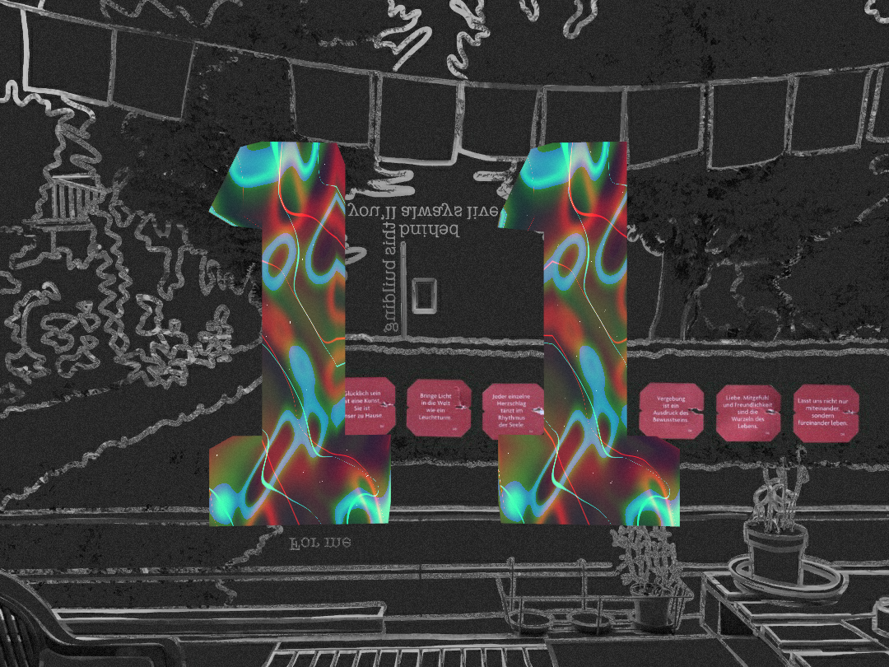
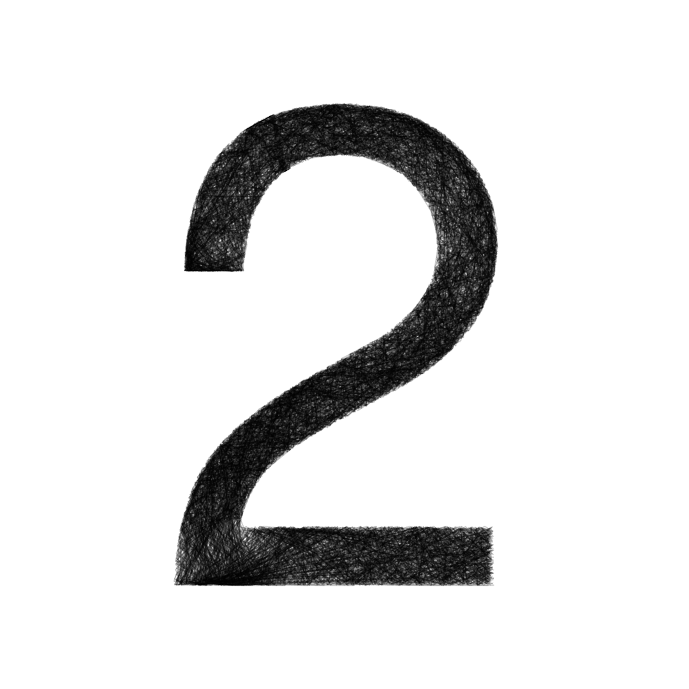

# ofxSoological

This is a personal project to learn how to code art with [openFrameworks (OF)](https://openframeworks.cc/) in C++. The intention is to regularly post a new OF app generating an animation or image. In this repo you can find the source code that generates and exports the results. Check out [@soo.logical](https://www.instagram.com/soo.logical/) on Instagram to see them & more!

## Contents
- [Available Posts](#avaialble-posts)
- [Structure of the Repo](#structure-of-the-repo)
- [Installation](#installation)

## Available Posts

| Post | Preview | Title | Category | Keywords|
|:----:|:-------:|:-----:|:--------:|:-------:|
|16||[Mandala out of Spirographs](post016/README.md)<br>|2D geometric shapes|`2D` `ofNode` `noise` `polymorphic function`
|15||[GPU Dancing Dots](post010/README.md)<br>(same as 10)|Fragment shader art|`shaders` `fragment shader` `2D texture` `uniform circular motion`
|14||[Dandelion Generator](post014/README.md)|2D geometric shapes|`2D` `grid` `circle` `ellipse` `rectangle` `line` `arrow` `noise`
|13||[Background & Font Animation](post013/README.md)|Basic color changes|`2D` `ofFont` `ofColor` `rotation` `animated background`
|12||[Image Color Emission](post012/README.md)|2D physical simulations|`2D` `dynamic brush` `uniform linear motion` `ofImage` `binary mask`
|11||[Mixed Composition with Textures](post011/README.md)|Fragment shader art|`shaders` `fragment shader` `2D texture` `3D model loading` `ofxPlasticTexture`
|10||[GPU Dancing Dots](post010/README.md)|Fragment shader art|`shaders` `fragment shader` `2D texture` `uniform circular motion`
|8||[Watercolor Drop Simulation](post008/README.md)|2D physical simulations|`2D` `dynamic brush` `painting simulation` `watercolors` `uniform linear motion`
|7||[Hairy Sticky Shapes](post007/README.md)|2D geometric shapes|`2D` `ofPolyline` `triangle brush`
|6||[Static Dragon Curve](post006/README.md)|Fractals|`2D` `ofNode` `recursivity` `fractal`
|5||[Deforming Line Intersections](post005/README.md)|2D geometric shapes|`2D` `ofPath` `ofPolyline` `bezier` `ofPolyline intersection`
|4||[Drawing with Deformed Circles](post004/README.md)|2D geometric shapes|`2D` `ofPath` `ofPolyline` `curve` `deformed circles`
|3||[Color Grid](post003/README.md)|Basic color changes|`2D` `ofColor` `grid` `mosaic`
|2||[Lines Inside a Shape](post002/README.md)|2D geometric rules|`2D` `ofPath` `ofPolyline` `line` `uniform linear motion`
|1||[Particles Inside a Circle](post001/README.md)|2D geometric rules|`2D` `circle` `uniform linear motion`

## Structure of the Repo
The repo is organised as follows:
- `libs` contains my own C++ libraries defining common utilities, as well as shapes, brushes, and other objects used to compose the visuals. See [the libs README](libs/README.md) for details.
- A folder `postXXX` defines the OF app behaviour (`setup()`, `update()`, `draw()`, etc.) in the regular files provided by the OF project generator (`main.cpp`, `ofApp.h`, and `ofApp.cpp`). 
- `test_app` defines an OF app that is used to unit test my libraries and some drawing functions.
- `scripts` contains non C++ scripts used to perfom external actions, e.g. generating a video from a set of frames.

## Installation
Requirements:
- [openFrameworks](https://openframeworks.cc/)

In order to run my apps, OF needs to be installed on your machine. You can follow their installation instructions [here](https://openframeworks.cc/download/) to do so.

The folder structure of the OF repository looks like this:
```bash
openFrameworks
├── addons
├── apps
├── examples
├── libs
├── scripts
├── ...
```
Inside `apps`, you can define your folders to group your sketches:

```bash
openFrameworks
├── ...
├── apps
    ├── projectGenerator
    ├── my_cool_sketches
    ├── my_cooler_sketches
```
 And inside these group folders, the OF project folders themselves must be placed.

 You can clone/download this repo under the `apps` folder in the openFrameworks structure. That way, you'll have all my `postXXX` project folders placed on the proper level of the tree, such that OF will take care of all the dependency linking automatically:
```bash
openFrameworks
├── ...
├── apps
    ├── projectGenerator
    ├── my_cool_sketches
    ├── my_cooler_sketches
    ├── ofxSoological
        ├── post001
            ├── src
                ├── main.cpp
                ├── ofApp.h
                ├── ofApp.cpp
```

Once the project structure is set up, in order to run an app just go inside the desired postXXX folder, compile it and run it:
```bash
openFrameworks/apps/ofxSoological$ cd postXXX
openFrameworks/apps/ofxSoological/postXXX$ make clean
openFrameworks/apps/ofxSoological/postXXX$ make
openFrameworks/apps/ofxSoological/postXXX$ make run
```
A window displaying the output of the post should open.

Note that some of the apps require an input image. For privacy, I will not always share the source image. In those cases, you will need to provide your own image and specify the corresponding path in `ofApp.h`.
