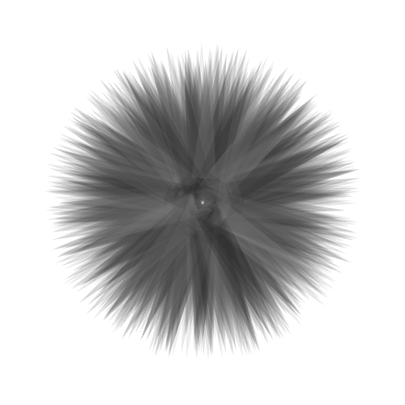
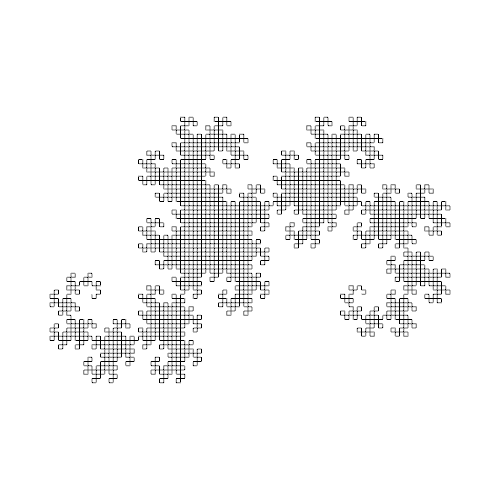
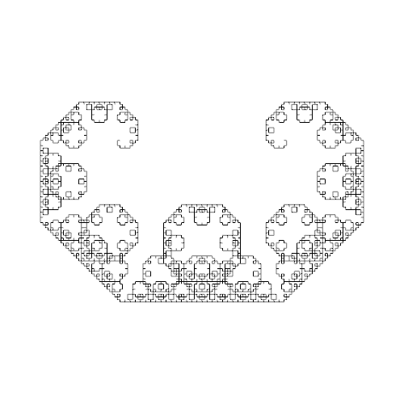
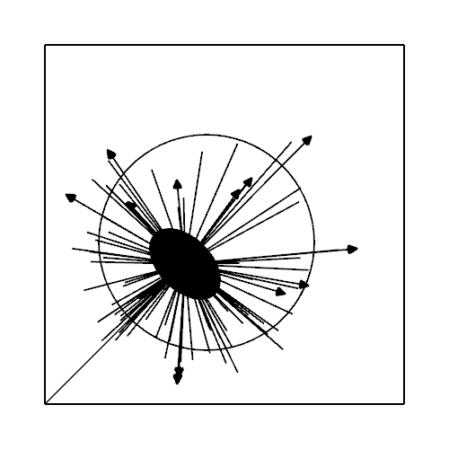
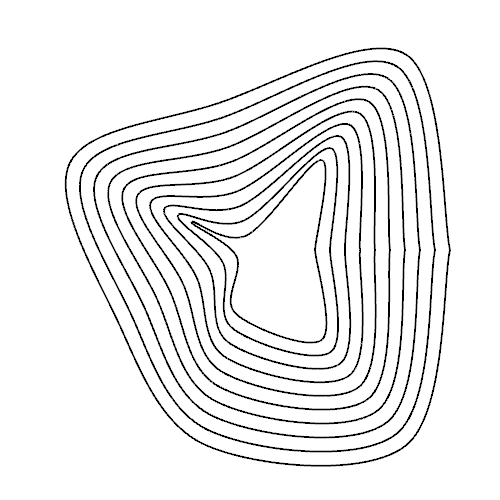
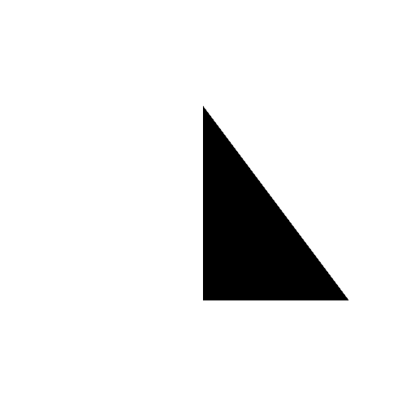
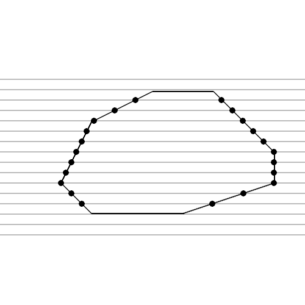
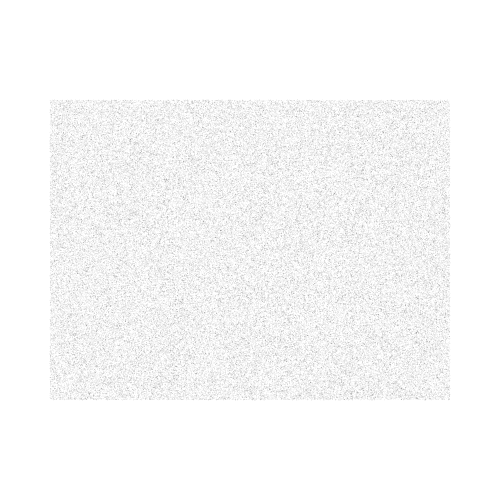

# Soo Libraries
## Contents
- [Overview](#overview)
- [Output Examples](#output-examples)
    - [Brushes](#brushes)
    - [Fractals](#fractals)
    - [Shapes](#shapes)
    - [Free Functions](#free-functions)

## Overview
I defined several libraries to simplify my sketches, as well as to 
make the code modular, reusable and understandable.

There are different categories of libraries:
- `brushes`: defines an abstract class `Brush` with a pure virtual function `draw()`. Different types of brushes might descend from this class and implement its own drawing behaviour.
- `fractals`: defines a hierarchy of 2D fractal curves descending from `CurveFractal`.
- `shapes`: defines independent objects representing custom shapes.
- `soo_XXX.h`: header libraries defining free functions with common utilities.
    - `soo_color_palettes`: defines static color palettes.
    - `soo_coordinates`: defines free functions to change coordinate systems, e.g. from polar to cartesian.
    - `soo_export`: defines free functions to export frames.
    - `soo_inside`: defines free functions to determine if a point is inside a shape, e.g. a point inside a circle.
    - `soo_intersection`: defines the polygon intersection boolean operation between shapes, e.g. an horizontal line vs. the contour of a closed polygon.
    - `soo_motion`: defines 2d physical movements, e.g. uniform linear motion.
    - `soo_noise`: defines free functions to generate visual 2D noise, e.g. random noise particles inside a rectangle.
    - `soo_vector`: defines free functions that generate specific kind of vectors, e.g. random unit vectors.

## Output Examples
### Brushes
<table>
  <tr>
    <td></td>
  </tr>
    <tr>
    <td>TrianglesOutBrush</td>
  </tr>
</table>

### Fractals
<table>
  <tr>
    <td></td>
    <td></td>
  </tr>
    <tr>
    <td>DragonCurve</td>
    <td>LevyCCurve</td>
  </tr>
</table>

### Shapes
<table>
  <tr>
    <td></td>
    <td></td>
    <td></td>
  </tr>
    <tr>
    <td>Dandelion</td>
    <td>DeformedLayeredCircle</td>
    <td>Triangle</td>
  </tr>
</table>

### Free Functions
<table>
  <tr>
    <td></td>
    <td></td>
  </tr>
    <tr>
    <td>soo_intersection</td>
    <td>soo_noise</td>
  </tr>
</table>