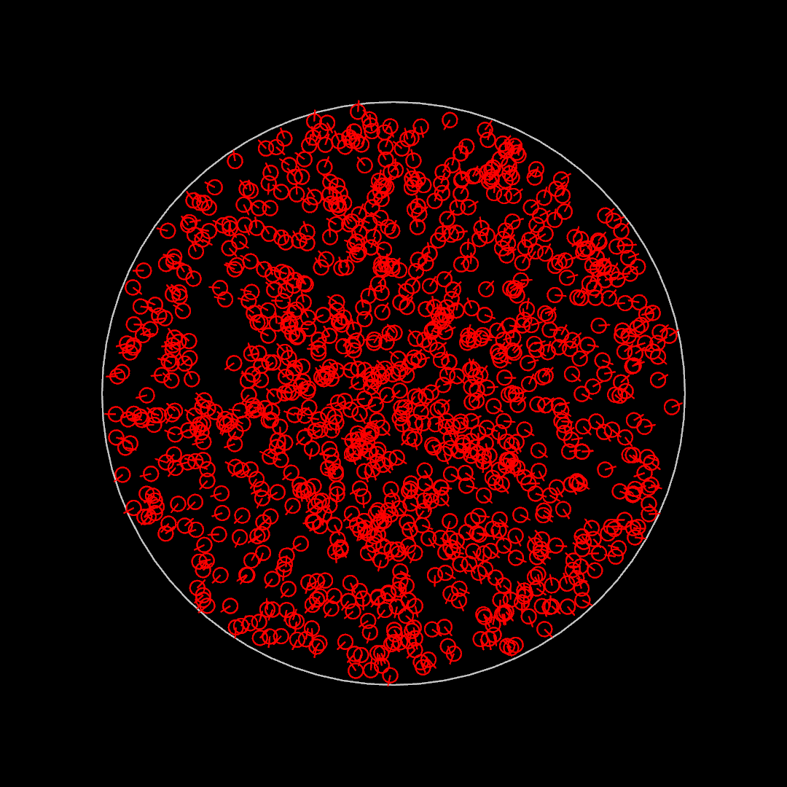

# Post 001: Particles inside a circle

Simple animation where a set of particles move linearly inside a circle.

### Regular Output

This is a frame of the regular output.

### Geometry Rules

This is a frame showing the geometric rules behind the animation.
