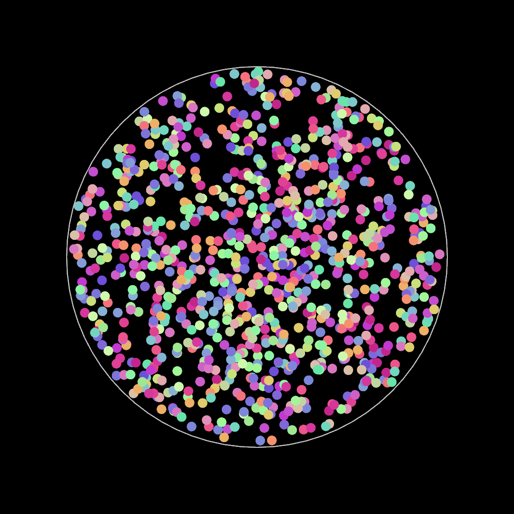

# Post 001: Particles Inside a Circle

Simple animation where a set of particles move linearly inside a circle.

### Output
   
First image is showing a frame of the regular output, while second image is representing the geometric rules behind the animation (particle border and moving direction).  
