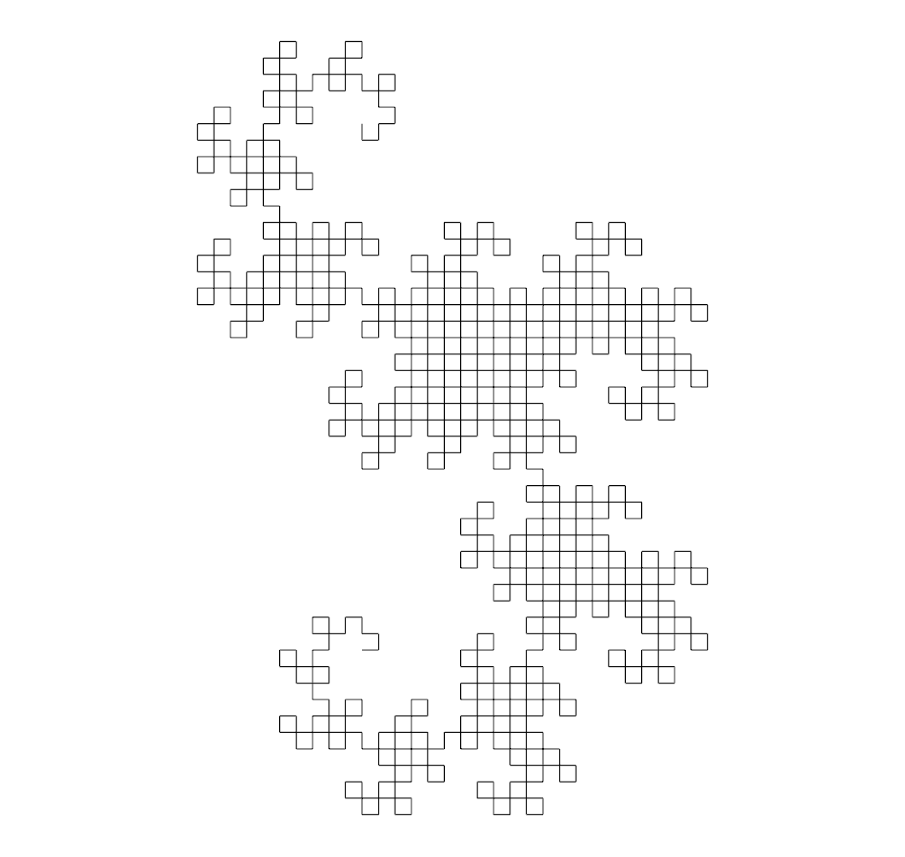
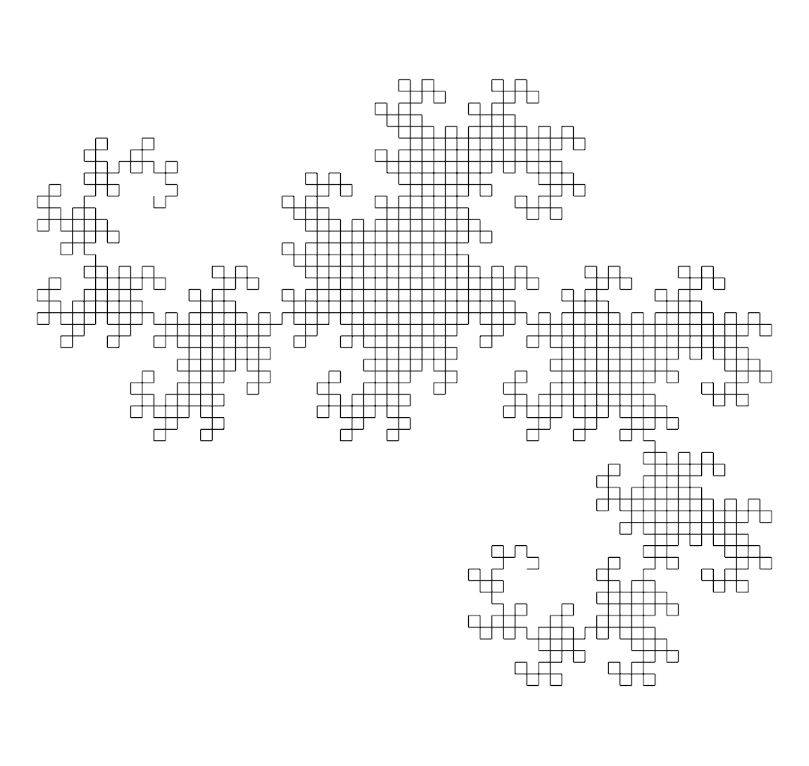
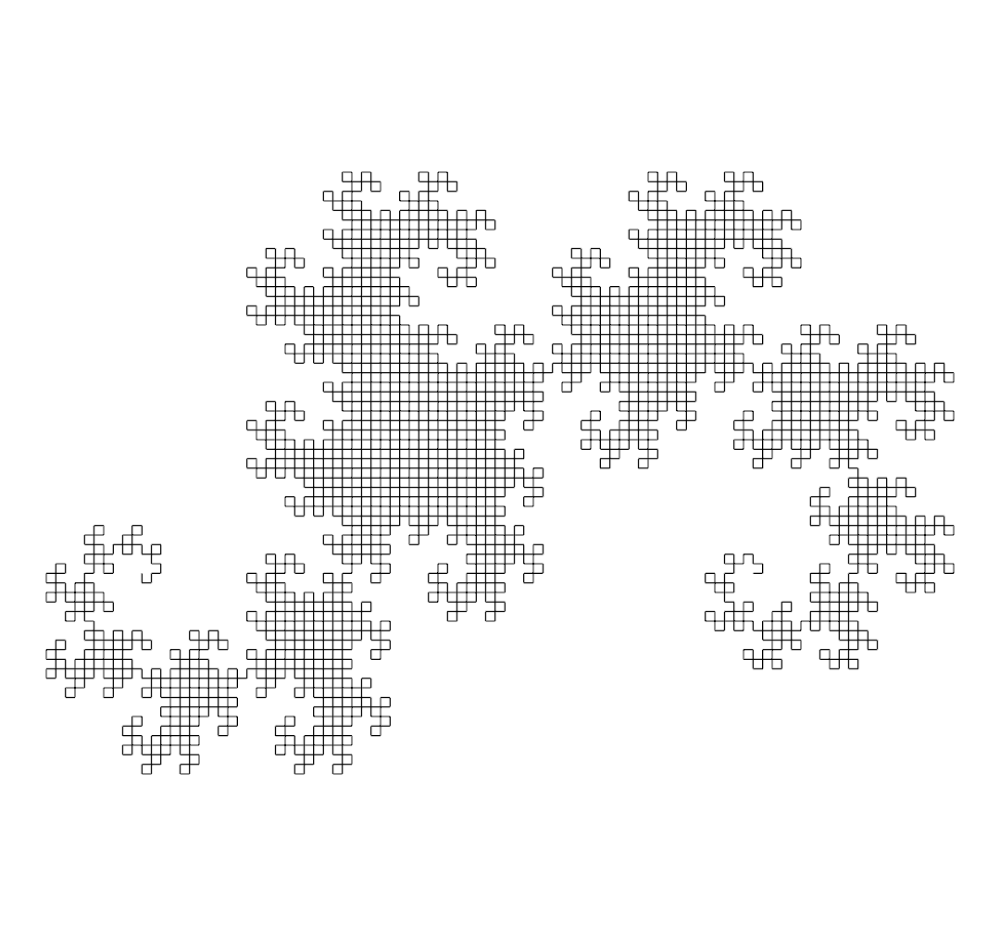
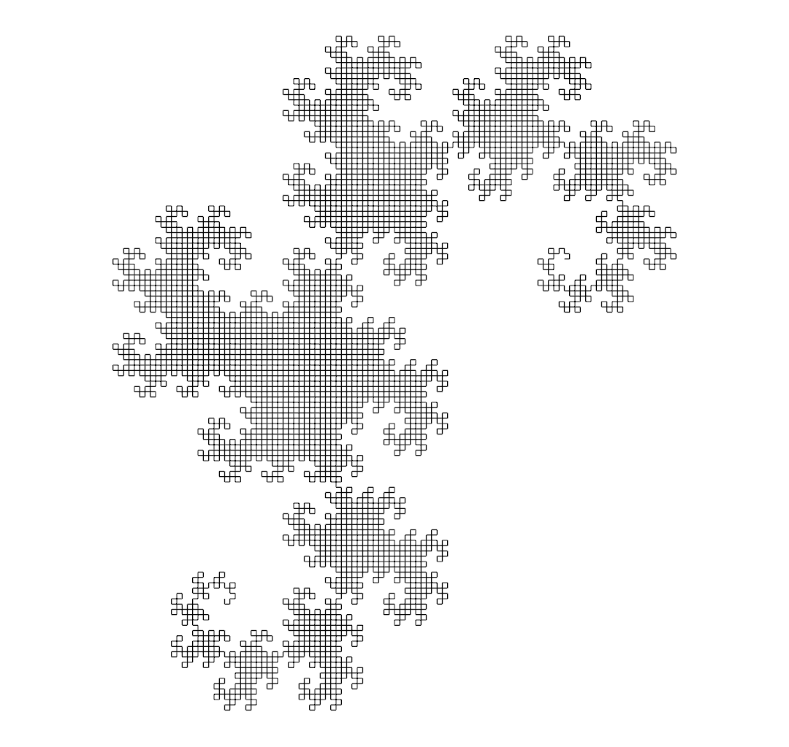
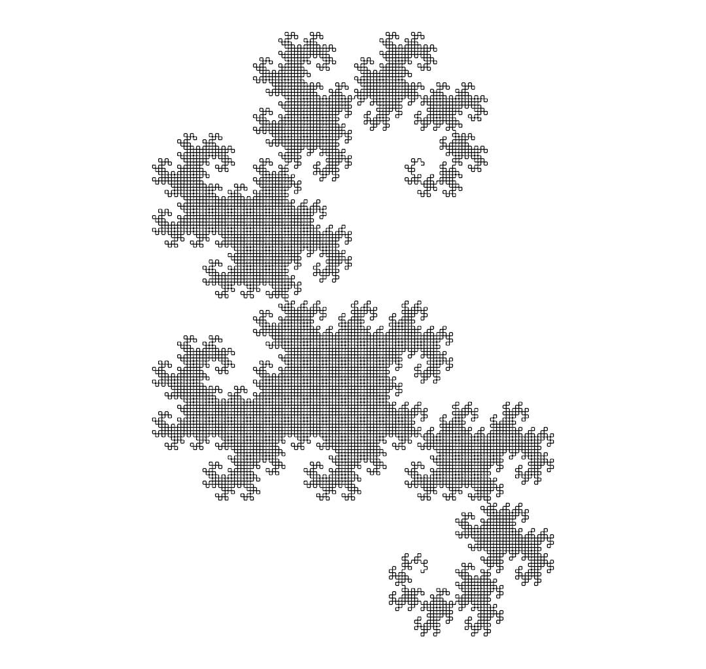

# Post 006: Static Dragon Curve

Recursive algorithm to generate the [Dragon Curve](https://en.wikipedia.org/wiki/Dragon_curve) fractal in 2D.
Given a number of iterations, it generates and renders the final result directly. No animation is provided for now.

### Output
#### Iterations = 10

#### Iterations = 11

#### Iterations = 12

#### Iterations = 13

#### Iterations = 14

#### Iterations = 15

