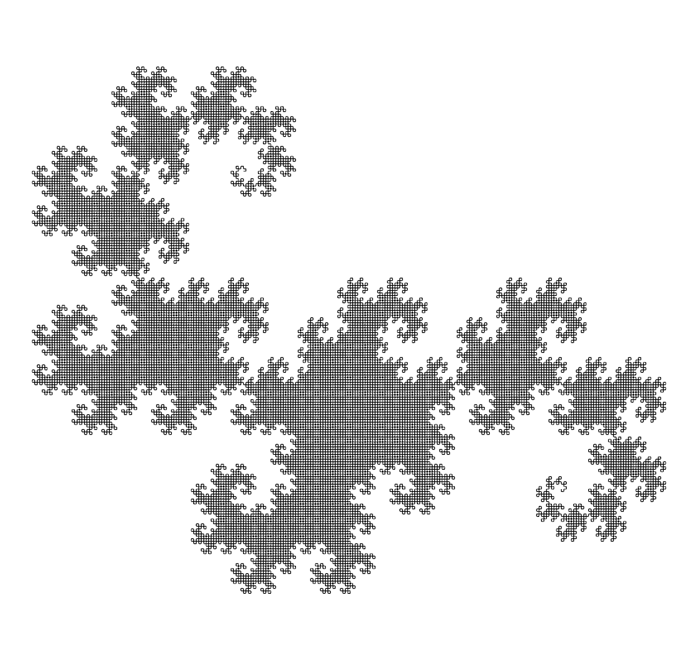

# Post 006: Static Dragon Curve

Recursive algorithm to generate the [Dragon Curve](https://en.wikipedia.org/wiki/Dragon_curve) fractal in 2D.
Given a number of iterations, it generates and renders the final result directly. No animation is provided for now.

### Output
#### Iterations 10 and 11

#### Iterations 12 and 13

#### Iterations 14 and 15

