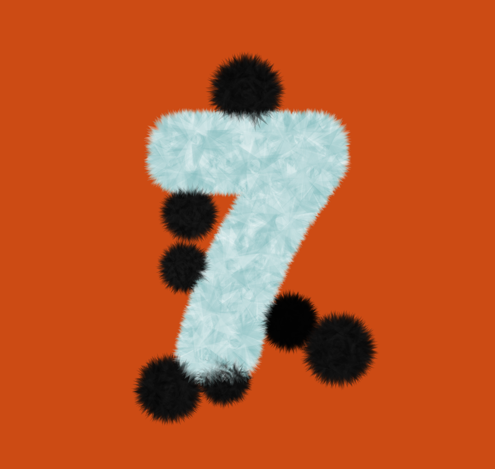

# Post 007: Hairy Sticky Shapes

Static composition of shapes defined by triangles pointing outside a center (see [TrianglesOutBrush](../libs/README.md#brushes)). Inspired by [this chapter](https://openframeworks.cc/ofBook/chapters/intro_to_graphics.html#brusheswithbasicshapes) of the ofBook.

### Output
 

