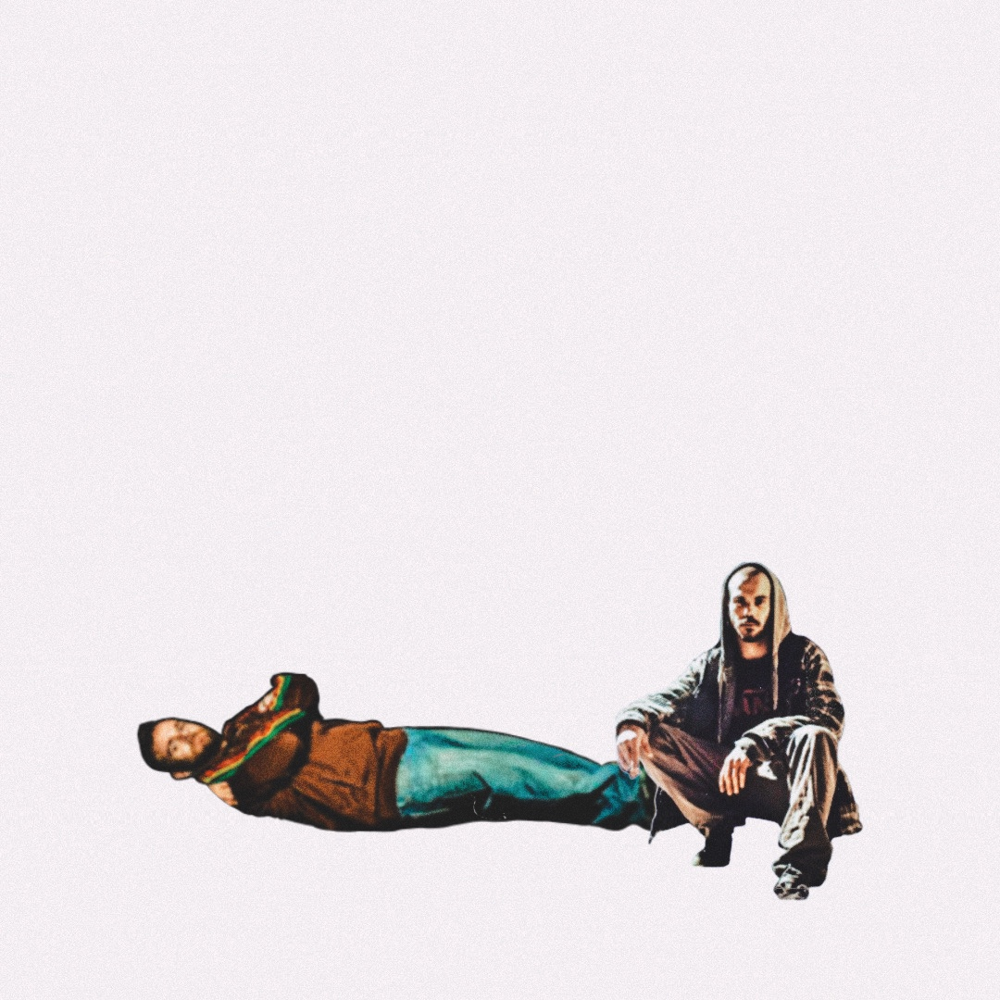
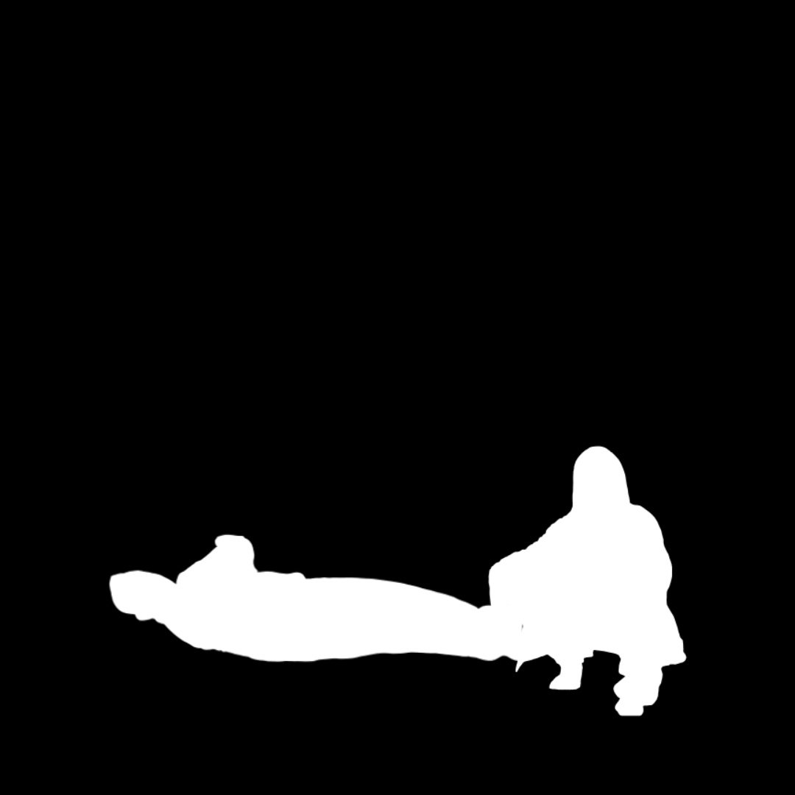

# Post 012: Image Color Emission

Loading a colored image and a binary mask, initialize some particles in the white part of the mask, asign the image color to them, and draw their movement trace.

### Input
 

### Output

