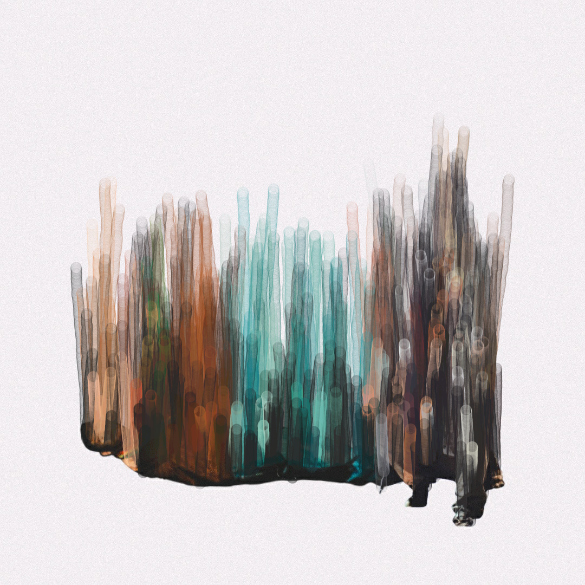

# Post 012: Image Color Emission

Loading a colored image and a binary mask, random particles are initialized on the white part of the mask and getting the respective color from the colored image. Then, the particles move up drawing their stroke on the canvas.

### Input
 

### Output

