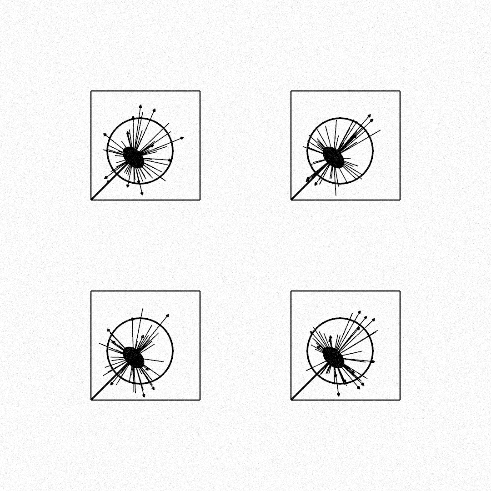

# Post 014: Dandelion Generator

A dandelion icon composed by several shapes is defined through a generator,
that adapts the size of the components of the dandelion to the size of its
bounding box. Each part of the dandelion can be drawn separately, in order to
customize the colors and the width of the lines.

For this example, a grid of dandelions is defined given the number of icons
per axis, plus values for the internal and external margins of the grid. There
is also the possibility to tune one of the icons differently.

An extra layer of noise has been applied to cover the whole image, and achieve
a grainy visual effect.

The design has been inspired by the logo of the dancing show "Dandelion" by
Carla Battaini.

### Output

  

  
