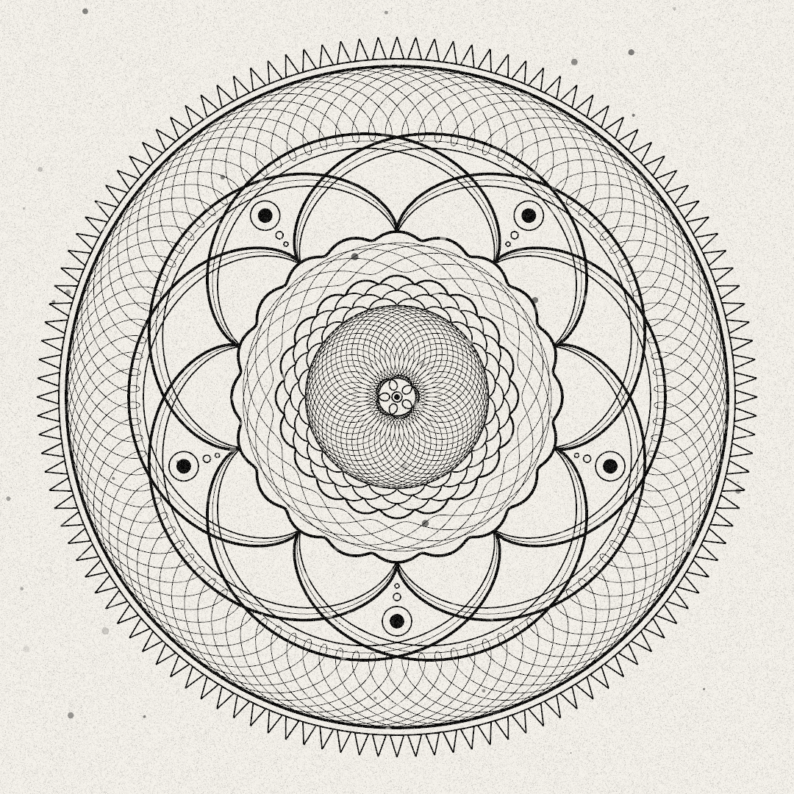

# Post 016: Mandala out of Spirographs

A [Spirograph](../libs/README.md#shapes) is composed by a chain of nodes. For this example, several spirographs of 2 to 3 nodes have been combined, in order to design a mandala. Each spirograph defines its own drawing function through a member function polymorphism. Screen noise is also added as a final layer of the composition.

The spirograph generation algorithm has been inspired by [this tutorial of Colorful Coding](https://www.youtube.com/watch?v=bqRvLR3PLf0).

### Output
 
