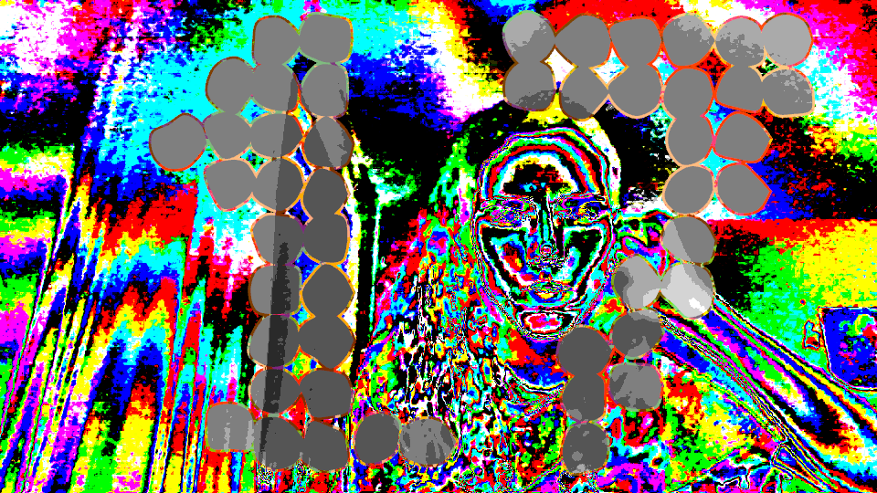

# Post 017: Glitch & Toon Holes Filter

The geometry of the rendering is composed by a collection of deformed circles that define the holes approximating a 17.

The colors are defined through a cocktail of shaders that apply different filters to the webcam input:
- [glitch shader](/bin/data/shaders/glitch.frag): main filter altering the webcam input to simulate a colorful pshychedelic glitch art effect.
- [stroke shader](/bin/data/shaders/stroke.frag): filter applied to the stroke of the holes which mixes the glitch shader effect with yellow and red.
- [holes shader](/bin/data/shaders/holes.frag): filter applied to the interior of the holes that maps the pixel colors to a shade of gray depending on its brightness (toon shading). The number of shades can be easily modified.

### Output
