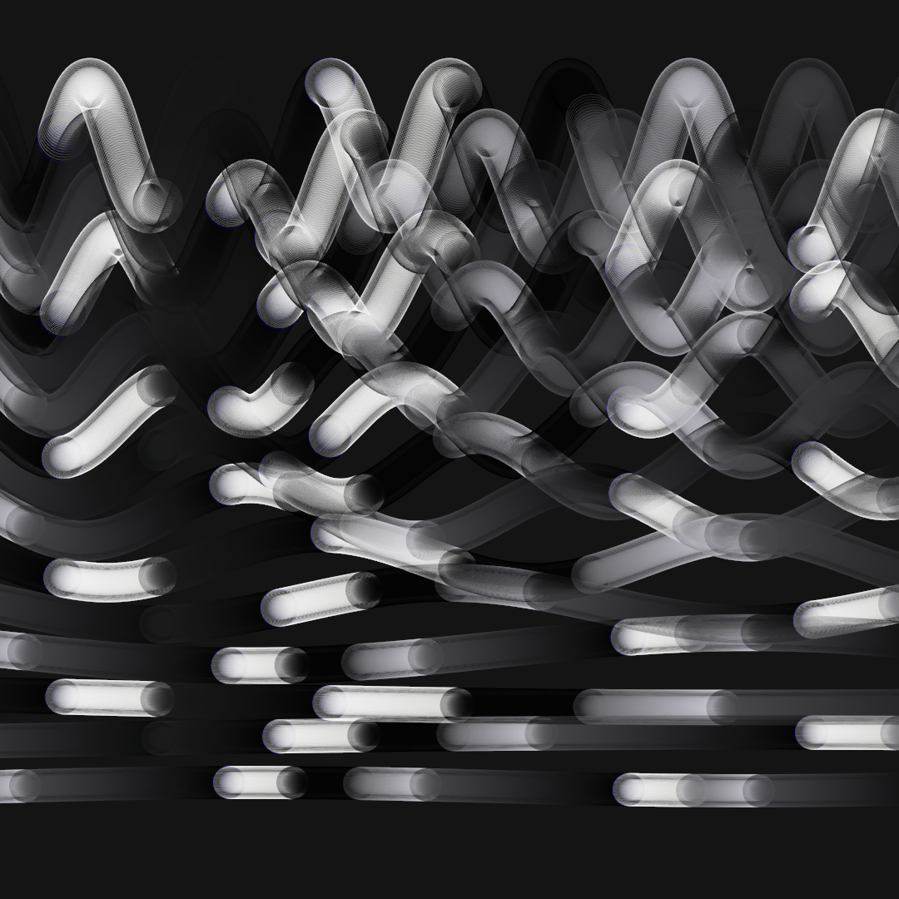

# Post 028: Sinus Representation & Color Palettes

Composition of several sinus functions with different wave frequencies and lenghts. Movement animated through the blending of colors in a chosen color palette. For the example, a black and white color palette is chosen, but other colored palettes can be applied as well. 

### Output

