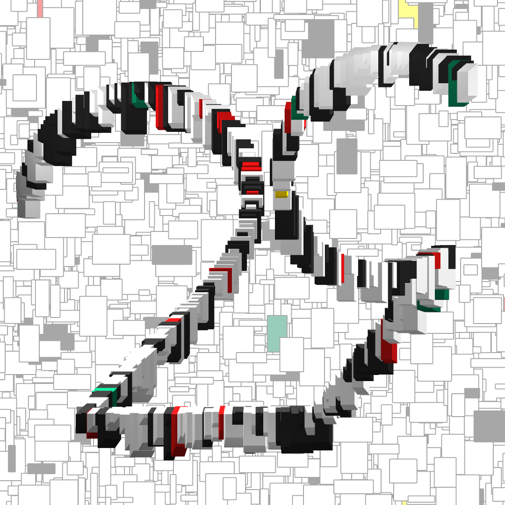

# Post 029: Outline out of Boxes

Composition of random boxes and rectangles representing the top part of the outline of a 29. The boxes follow the outline in the foreground, while the rectangles customize the background. A weighted color palette has been defined in order to pick the colors randomly, but with fixed probabilities. In this example, it is more likely to randomly pick white than red, for instance. All the parameters can be easily tuned. They include:
- The color probabilities
- The translucence of the background
- The size limits of the background rectangles
- The size limits of the the foreground boxes
- The spacing between the foreground boxes

### Output

